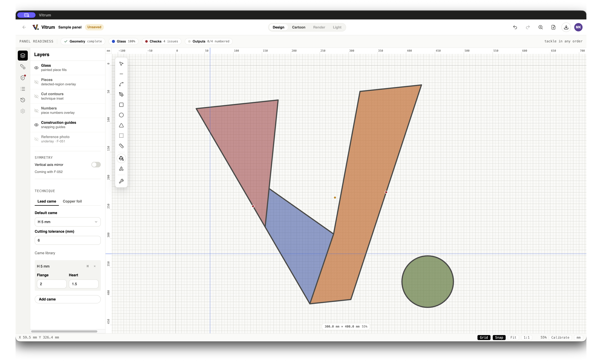

<h1>
  
  &nbsp;Vitrum
</h1>

Vitrum is a desktop studio for designing stained glass — the cartoon, the pieces,
the lead lines, the cut list — without wrestling a CAD tool that was never built for
glass. It runs on your own machine, keeps your hands on the work, and gets out of
the way.

Think of it as the graph paper, the light table, and the fussy friend who reminds
you that _no, that reverse curve will never cut clean_ — rolled into one. You draw
the design; Vitrum keeps track of every piece, every colour, and every awkward angle
so that when you finally reach for the glass cutter, the surprises are the good kind.

It's early days, and the workshop is very much still being built. If you make glass,
write code, or both, you're in the right place.

## A look inside



_The design view — layers and technique on the left, glass and lead on the canvas,
and a readiness strip that tracks geometry, glass, checks, and numbering as you work._

---

## For makers

The idea is simple: the software should feel like part of the craft, not a tax on
it. A few things Vitrum is growing toward:

- **Design the way you think** — sketch panels, cut them into pieces, and let the
  lead lines fall where they should.
- **Catch trouble before the glass does** — checks that flag pieces which are a pain
  (or impossible) to cut before you've wasted a good sheet.
- **From screen to bench** — printable full-size templates, piece numbering, and a
  cutting list that tells you exactly how much of each glass to buy.

Nothing here is a toy render for its own sake — every feature earns its place by
saving you time, glass, or frustration at the bench.

---

## For developers

Desktop application for stained glass design, built with Svelte 5 and Electron.

### Structure

pnpm workspace monorepo:

| Package         | Purpose                                                                            |
| --------------- | ---------------------------------------------------------------------------------- |
| `packages/core` | Pure TypeScript domain logic (panels, glass pieces, geometry). No UI dependencies. |
| `packages/ui`   | Svelte 5 components. Can run standalone in a browser for fast iteration.           |
| `apps/desktop`  | Electron shell (main, preload, renderer) built with electron-vite.                 |

### Getting started

```sh
pnpm install
pnpm dev        # Electron app with hot reload
pnpm dev:ui     # UI only, in the browser
```

### Quality gates

Every change must pass all of these (CI enforces them on every push and PR):

```sh
pnpm lint          # ESLint (flat config, TypeScript + Svelte)
pnpm format:check  # Prettier
pnpm check         # tsc + svelte-check per package
pnpm test          # Vitest unit/component tests (core + ui)
pnpm test:e2e      # Playwright driving the built Electron app
```

### Workflow: trunk-based development

- `main` is the trunk and is always releasable.
- Work in short-lived branches (hours to a couple of days), merged via small PRs.
- Every PR runs the full quality gate; merge only on green.
- New code ships with tests: domain logic in `core` gets unit tests, components in
  `ui` get Testing Library tests, and user-facing flows get a Playwright E2E test.
- Prefer feature flags over long-lived branches for incomplete work.

### TypeScript

The repo uses stable TypeScript 5.x. TypeScript 7 (the native compiler) is stable
since July 2026, but Svelte template type-checking against it is still experimental.
Once `svelte-check` support stabilizes (expected with TS 7.1), switch by updating the
`typescript` dependency and adding `--tsgo` to the `check` script in `packages/ui`.
