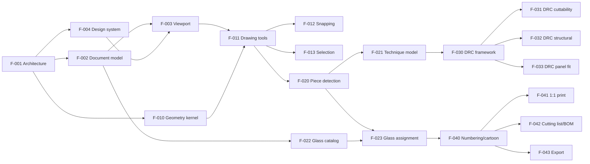

# Vitrum — Feature Roadmap

Vitrum is a CAD-grade design application for stained glass. It borrows its interaction
model from mechanical/electronic CAD (parametric sketching, snapping, a strict
document/command model) and its correctness culture from EDA tools like KiCad
(design rule checks mapped to glass manufacturability). Functionally it aims to cover —
and then exceed — the feature set of existing tools such as [Diafane](https://diafane.com/en/)
and Glass Eye 2000. See [docs/research/competitive-analysis.md](docs/research/competitive-analysis.md).

## Product principles

1. **The lead line network is the single source of truth.** Pieces, cut contours,
   cutting lists, prints and renders are all _derived_ from the line network plus
   technique parameters — never drawn or maintained separately. (Analogous to the
   schematic/netlist in EDA: everything downstream regenerates from it.)
2. **CAD discipline.** Stable entity IDs, a command pattern with unlimited undo/redo,
   real-world units (mm first, inch supported), precise snapping, and a geometry
   kernel that is a pure, well-tested library independent of the UI.
3. **Design rules, not tribal knowledge.** Whether a panel can actually be cut, built
   and hung is checked by an extensible DRC engine (KiCad-style): violations are
   surfaced live with severity levels, locations, and explanations.
4. **Derived manufacturing outputs.** Full-scale tiled cartoons, numbered pattern
   pieces, cutting lists and BOMs are one click away and always in sync with the design.
5. **Local-first.** Designs are files the user owns; the app works offline.
6. **One design language.** All UI follows the Vitrum Design System (Claude Design
   project, vendored via [F-004](docs/features/F-004-design-system.md)): design
   tokens only, core components only, chrome per the `ui_kits/studio` screens. Each
   spec's **Design** section names what applies.

## How to use this roadmap (for implementing agents)

Each feature has one self-contained spec in [docs/features/](docs/features/), following
[docs/features/TEMPLATE.md](docs/features/TEMPLATE.md). The workflow per feature:

1. Pick the lowest-numbered feature whose **Depends on** list is fully implemented.
2. Read the spec plus the specs it depends on. Resolve any **Open questions** with
   Mathieu _before_ writing code.
3. Plan, implement, test against the **Acceptance criteria**, and demo.
4. Update the spec's `Status` field (`draft → agreed → in-progress → done`) and record
   deviations from the spec in a short "Implementation notes" section at the bottom.

Engineering conventions, the decided stack (Svelte 5 + Electron desktop app, pnpm
monorepo), and the quality gates live in [CLAUDE.md](CLAUDE.md).

Features are implemented by the **feature-implementer** agent
([.claude/agents/feature-implementer.md](.claude/agents/feature-implementer.md)) —
launch it with a ticket id ("implement F-002") or let it pick the next unblocked
feature. The agent definition accumulates project learnings after each feature;
proposals to extend it go through Mathieu.

Numbering leaves gaps so new features can be inserted. Later-phase specs (4–5) are
intentionally lighter; they must be expanded and re-approved before implementation.

## Phases

### Phase 0 — Foundations

| ID                                              | Feature                                                            | Depends on          |
| ----------------------------------------------- | ------------------------------------------------------------------ | ------------------- |
| [F-001](docs/features/F-001-architecture.md)    | Architecture & project scaffolding                                 | —                   |
| [F-002](docs/features/F-002-document-model.md)  | Document model, persistence, undo/redo                             | F-001               |
| [F-003](docs/features/F-003-canvas-viewport.md) | Canvas viewport: pan/zoom, units, grid, rulers                     | F-001, F-002, F-004 |
| [F-004](docs/features/F-004-design-system.md)   | Design system integration (tokens, core components, studio chrome) | F-001               |

### Phase 1 — The sketcher (CAD drawing core)

| ID                                                | Feature                                  | Depends on          |
| ------------------------------------------------- | ---------------------------------------- | ------------------- |
| [F-010](docs/features/F-010-geometry-kernel.md)   | Geometry kernel                          | F-001               |
| [F-011](docs/features/F-011-drawing-tools.md)     | Drawing tools: line, arc, bézier, shapes | F-002, F-003, F-010 |
| [F-012](docs/features/F-012-snapping.md)          | Snapping & construction guides           | F-011               |
| [F-013](docs/features/F-013-selection-editing.md) | Selection, node editing & transforms     | F-011               |

### Phase 2 — Stained glass domain

| ID                                               | Feature                                  | Depends on   |
| ------------------------------------------------ | ---------------------------------------- | ------------ |
| [F-020](docs/features/F-020-piece-detection.md)  | Piece detection (planar graph → faces)   | F-010, F-011 |
| [F-021](docs/features/F-021-technique-model.md)  | Technique model: lead came & copper foil | F-020        |
| [F-022](docs/features/F-022-glass-catalog.md)    | Glass catalog                            | F-002        |
| [F-023](docs/features/F-023-glass-assignment.md) | Glass assignment & panel rendering       | F-020, F-022 |

### Phase 3 — Design rule checks (the KiCad move)

| ID                                              | Feature                             | Depends on   |
| ----------------------------------------------- | ----------------------------------- | ------------ |
| [F-030](docs/features/F-030-drc-framework.md)   | DRC framework & violations UI       | F-020, F-021 |
| [F-031](docs/features/F-031-drc-cuttability.md) | DRC rule pack: cuttability          | F-030        |
| [F-032](docs/features/F-032-drc-structural.md)  | DRC rule pack: structural integrity | F-030, F-023 |
| [F-033](docs/features/F-033-drc-panel-fit.md)   | DRC rule pack: panel fit            | F-030, F-058 |

### Phase 4 — Production outputs

| ID                                               | Feature                                 | Depends on          |
| ------------------------------------------------ | --------------------------------------- | ------------------- |
| [F-040](docs/features/F-040-piece-numbering.md)  | Piece numbering & cartoon view          | F-020, F-023        |
| [F-041](docs/features/F-041-print-tiling.md)     | 1:1 printing with tiling                | F-040               |
| [F-042](docs/features/F-042-cutting-list-bom.md) | Cutting list & bill of materials        | F-021, F-023, F-040 |
| [F-043](docs/features/F-043-export.md)           | Export: SVG, PDF, DXF, cutting machines | F-021, F-040        |

### Phase 5 — Power features

| ID                                                    | Feature                                           | Depends on          |
| ----------------------------------------------------- | ------------------------------------------------- | ------------------- |
| [F-050](docs/features/F-050-svg-import.md)            | SVG import                                        | F-011, F-020        |
| [F-051](docs/features/F-051-reference-image.md)       | Reference image underlay & perspective correction | F-003               |
| [F-052](docs/features/F-052-symmetry.md)              | Live symmetry                                     | F-011, F-013        |
| [F-053](docs/features/F-053-realistic-render.md)      | Realistic glass rendering                         | F-023               |
| [F-054](docs/features/F-054-light-simulation.md)      | Sunlight simulation                               | F-053               |
| [F-055](docs/features/F-055-versioning-sharing.md)    | Versioning & sharing                              | F-002               |
| [F-056](docs/features/F-056-cost-estimation.md)       | Cost estimation & quoting                         | F-042               |
| [F-057](docs/features/F-057-nesting.md)               | Sheet nesting & yield optimization                | F-042               |
| [F-058](docs/features/F-058-panel-library.md)         | Panel library & launch screen                     | F-002, F-055        |
| [F-059](docs/features/F-059-autotrace.md)             | Raster autotrace — scanned cartoons to lead lines | F-050, F-051        |
| [F-060](docs/features/F-060-pattern-templates.md)     | Pattern templates (parametric generators)         | F-058               |
| [F-061](docs/features/F-061-panel-lifecycle.md)       | Panel lifecycle & workshop status                 | F-058               |
| [F-063](docs/features/F-063-glass-library-home.md)    | Glass library home (launch-screen destination)    | F-022, F-058        |
| [F-064](docs/features/F-064-photorealistic-render.md) | Photorealistic render & light                     | F-053, F-054        |
| [F-065](docs/features/F-065-constraints.md)           | Parametric constraints                            | F-010, F-012, F-013 |

## Backlog — ids reserved, not yet scoped

Ideas that specs already point at by number, but which have **no spec and no agreed
scope**. They live here so a reference like "→ F-060" is findable and so the same
number is never claimed twice (it has happened). Nothing here is implementable: give it
a spec from [TEMPLATE.md](docs/features/TEMPLATE.md) first, then a ROADMAP row above.

| ID    | Idea                                                                                          | Referenced by |
| ----- | --------------------------------------------------------------------------------------------- | ------------- |
| F-062 | Manufacturer glass catalogs (Bullseye, Wissmach, Oceanside, …); needs data/licensing research | F-022         |
| F-066 | Dimension annotations & parameters: printable dimensions, named variables, parametric resize  | F-065         |

**Allocating an id**: add the row here the moment a spec first cites the number, and
never reuse one. F-058 was briefly cited by F-022 as "manufacturer-catalogs" before it
became the panel library — that ambiguity is exactly what this table exists to stop.

## Dependency shape

Phase 5 features hang off the trunk independently and can be reordered by interest.

## Milestones

- **M1 "Sketchpad"** (end of Phase 1): draw a lead-line design with CAD-grade precision,
  save/load it, undo anything.
- **M2 "It's a window"** (end of Phase 2): pieces are detected, glass is assigned,
  the panel renders in color for both lead and foil techniques.
- **M3 "It can be built"** (end of Phase 3): DRC proves the design is cuttable and
  structurally sound.
- **M4 "Workshop-ready"** (end of Phase 4): print the cartoon 1:1, hand the cutting
  list to the bench. This is rough feature parity with Diafane's core.
- **M5+**: differentiation — simulation, quoting, nesting.
